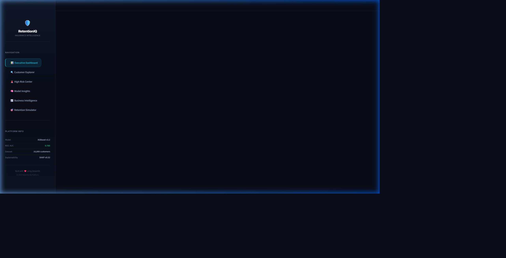
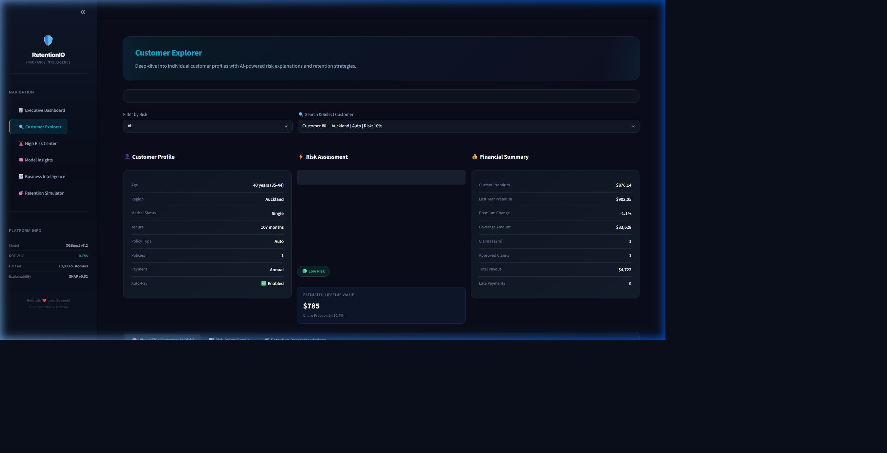
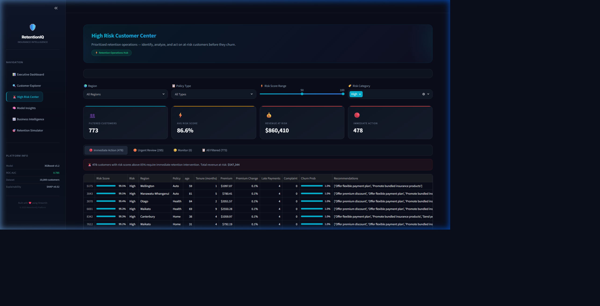
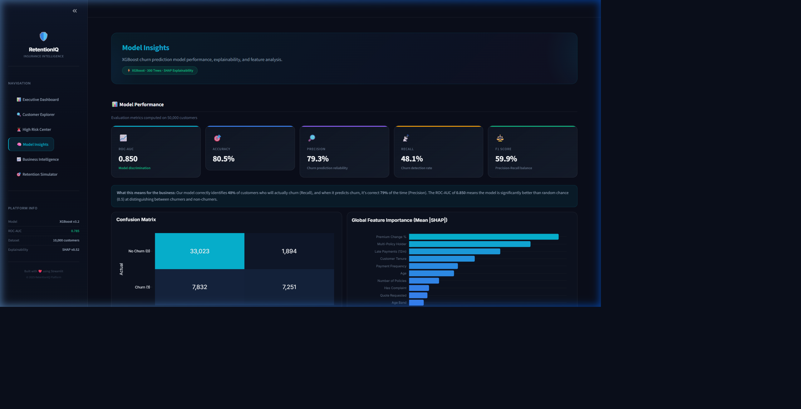
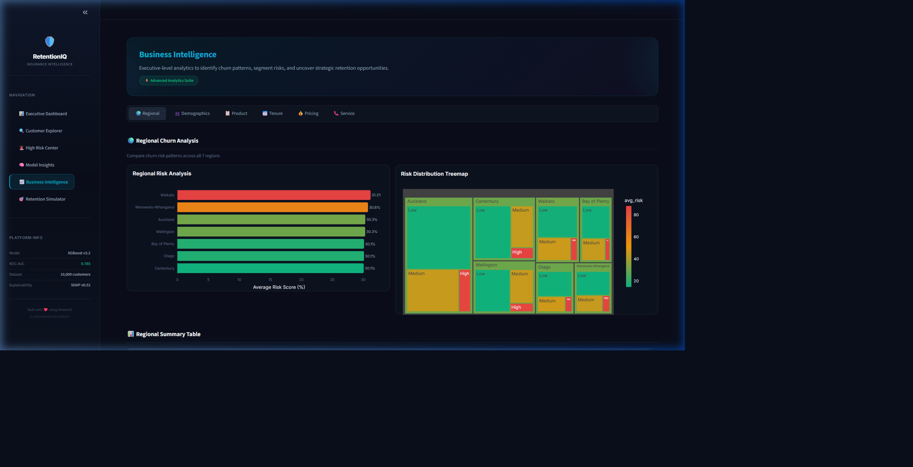
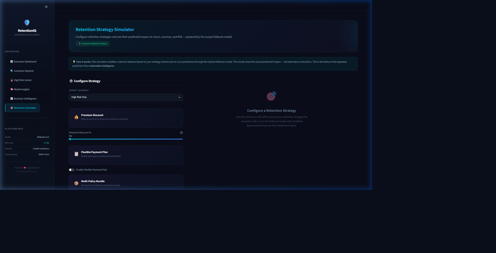

# 🛡️ RetentionIQ — Insurance Customer Retention Intelligence Platform

An enterprise-grade B2B Customer Retention and Churn Analytics SaaS platform built for insurance executives and retention operations managers. 

This platform uses an end-to-end Machine Learning pipeline to predict customer churn risk, explain individual and global risk factors using SHAP (Explainable AI), and simulate the financial impact of retention strategies in real-time.



---

## 🚀 Key Features

### 1. 📊 Executive Dashboard
* **Portfolio Health Score**: Weighted KPI indicating overall portfolio stability.
* **Executive Metrics**: Total Customers, High-Risk counts, Revenue at Risk, expected annual loss, and Model Confidence (ROC-AUC 0.785).
* **Plotly Visualizations**: Beautiful, interactive charts showing regional risk analysis, policy type breakdowns, and behavioral correlations.


### 2. 🔍 Customer Explorer
* **Detailed Profiling**: Demographics, tenure, policy characteristics, and financial summary for individual policyholders.
* **Risk Gauge**: Zone-highlighted gauge (Low/Medium/High) showing exact churn probability.
* **Explainable AI (SHAP)**: Interactive Plotly waterfall chart showing the exact positive and negative drivers of risk for the selected customer.
* **AI-Generated Recommendations**: Proactive, tailored retention strategies derived from customer features.



### 3. 🚨 High Risk Customer Center
* **Retention Operations Hub**: Filter and search across New Zealand regions, policy types, and risk ranges.
* **Priority Action Tiers**: Automated grouping into *🔴 Immediate Action* (Risk > 85%), *🟠 Urgent Review* (Risk 70-85%), and *🟡 Monitor* (Risk 50-70%).
* **Actionable Exports**: Single-click downloads for filtered datasets and urgent intervention reports.



### 4. 🧠 Model Insights
* **Production-Grade Metrics**: Evaluates ROC-AUC, Accuracy, Precision, Recall, and F1 Score.
* **Interactive Confusion Matrix**: Plotly-based confusion heatmap.
* **Global Interpretability**: SHAP global feature importances and interactive SHAP dependence analysis for numerical features.
* **Business Translation**: Plain-English summaries mapping model statistics to business value.



### 5. 📈 Business Intelligence
* Deep-dive segmentation analysis across 6 dedicated tabs:
  - **🌍 Regional**: Interactive treemap of risk and regional summaries.
  - **👥 Demographics**: Age band and marital status churn correlations.
  - **📋 Product**: Policy types and risk-to-churn Sankey flow diagrams.
  - **📅 Tenure**: Cohort analytics showing early-tenure churn risk.
  - **💰 Pricing**: Impact of premium increases and auto-pay adoption.
  - **📞 Service**: Correlation of complaints and contact frequency with churn.



### 6. 🎯 Retention Strategy Simulator (Showstopper Feature)
* **What-If Analysis Engine**: Configure premium discounts, flexible payment plans, multi-policy bundles, and dedicated support.
* **Real-time Model Inference**: Re-predicts churn probabilities for the selected segment using the actual trained XGBoost classifier on the fly.
* **Financial Impact & ROI**: View customers saved, annual/lifetime revenue retained, campaign costs, and exact Campaign ROI.
* **Strategy Impact Report**: Clean, copy-pasteable executive summary for presentation.



---

## 🏗️ Project Architecture & Directory Structure

To maintain a clean separation of concerns, the repository is segregated into a front-end UI presentation layer, a business logic layer, and storage layers:

```
├── ui/                     # Front-end UI Presentation Layer
│   ├── components/         # Reusable widgets (sidebar, metrics, charts)
│   │   ├── charts.py       # Custom Plotly chart builders
│   │   ├── metrics.py      # Premium glassmorphic metric cards
│   │   └── sidebar.py      # Custom branded navigation sidebar
│   ├── pages_app/          # Streamlit page modules (views)
│   │   ├── executive_dashboard.py
│   │   ├── customer_explorer.py
│   │   ├── high_risk_center.py
│   │   ├── model_insights.py
│   │   ├── business_intelligence.py
│   │   └── retention_simulator.py
│   └── styles/             # Global visual styling overrides
│       └── theme.py        # Premium glassmorphic CSS dark theme injection
│
├── utils/                  # Business & Machine Learning Logic Layer
│   ├── data_loader.py      # Pandas ETL pipelines & cached data loader
│   ├── retention_engine.py # Feature manipulation & live strategy simulations
│   └── shap_engine.py      # TreeExplainer inference & SHAP aggregation
│
├── models/                 # Serialized Machine Learning artifacts
│   └── xgboost_pipeline.joblib
│
├── config.py               # Shared app configuration, variables & colors
├── app.py                  # Main app controller & routing entrypoint
├── requirements.txt        # Virtual environment dependencies
└── README.md               # Project documentation
```

---

## 🛠️ Technology Stack
* **Frontend/App Framework**: Streamlit (Premium dark styling, custom glassmorphic CSS, responsive grid layouts).
* **Machine Learning**: XGBoost Classifier (300 estimators, learning rate 0.05, max depth 6).
* **Explainability**: SHAP (TreeExplainer).
* **Visualizations**: Plotly (custom dark layouts matching the platform's theme).
* **Data Processing**: Pandas, NumPy, Scikit-Learn.

---

## 🏃 How to Run the Platform

1. **Activate the Virtual Environment**:
   ```powershell
   .\venv\Scripts\Activate.ps1
   ```
2. **Run the Streamlit Application**:
   ```powershell
   streamlit run app.py --server.port 8501
   ```
3. Open `http://localhost:8501` in your browser.